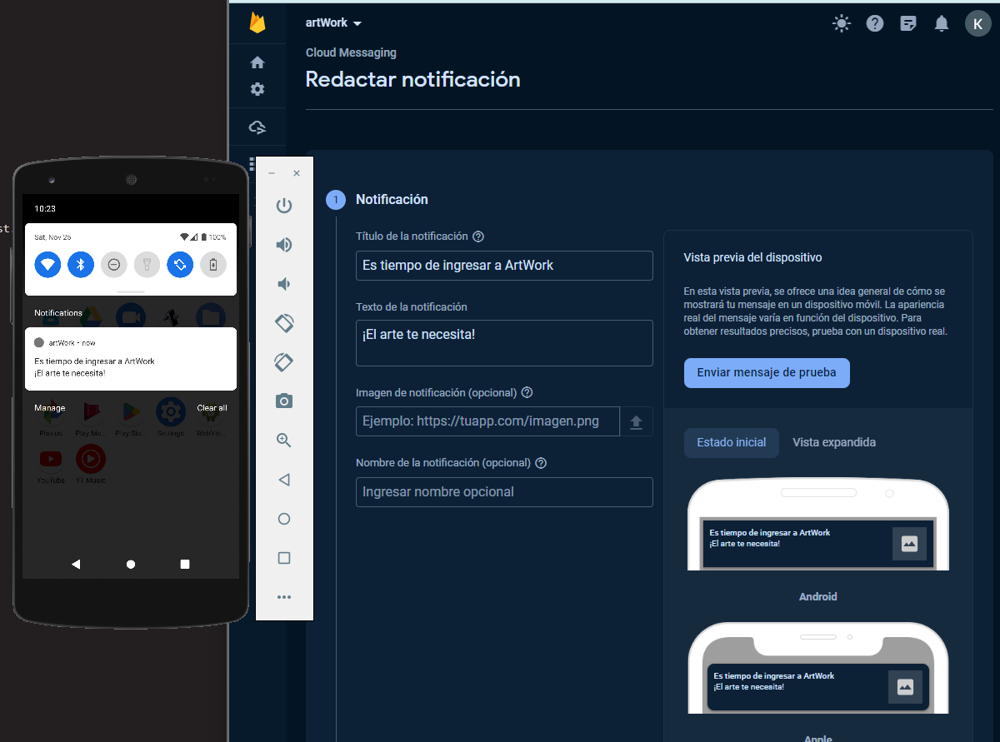
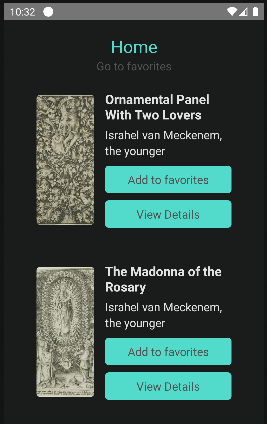
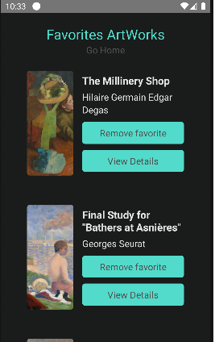

# ArtWorks Catalog App

An awesome mobile application built using React Native to explore and discover artworks from the Art Institute of Chicago's API. The app allows users to browse a catalog of artworks, view details of each artwork, add favorites, and receive notifications using Firebase Cloud Messaging.

## Features

- Browse through a catalog of artworks from the Art Institute of Chicago.
- View detailed information about each artwork, including title, artist, and description.
- Add artworks to favorites for quick access.
- Notification system using Firebase Cloud Messaging to provide updates and alerts.

## Screenshots





## Getting Started

Follow these instructions to get a copy of the project up and running on your local machine for development and testing purposes.

### Prerequisites

- Node.js and npm installed.
- Android Studio / Xcode for emulating on mobile devices.
- Firebase account for using Firebase Cloud Messaging.

### Installation

1. Clone the repository.
   ```bash
   git clone https://github.com/stivenm16/ArtWork-NotificationsSystem.git
   ```
2. Install dependencies

```bash
   cd artworks-catalog-app
   npm install
```

3. Set up Firebase configurations.

- Obtain Firebase configurations and add them to the app.
- Follow Firebase documentation for setup.

4. Run the app

```bash
   npm run android # For Android
   npm run ios # For iOS
```

### Technologies Used

- React Native
- TypeScript
- Firebase Cloud Messaging
